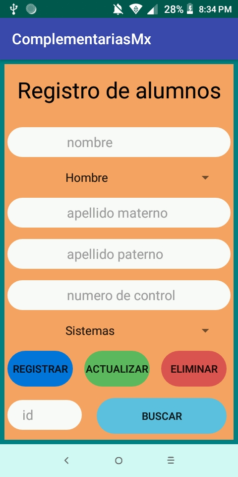
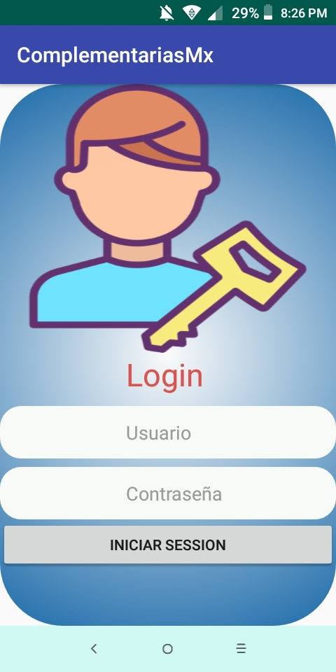

# complementarias

En esta aplicacion de conecta a una base de datos mysql mediante php y tambien se hace uso de json para manejar 
la imformacion

#Tecnologias usadas

CustomView  
Consumo de web services (Volley)  
Control de versiones GIT  
Java  
Mysql  
##video de demostracion
https://www.youtube.com/watch?v=vd6p1DdOeTQ

<table>
  <tr>
  <td></td> <td></td>
  </tr>
  </table>
